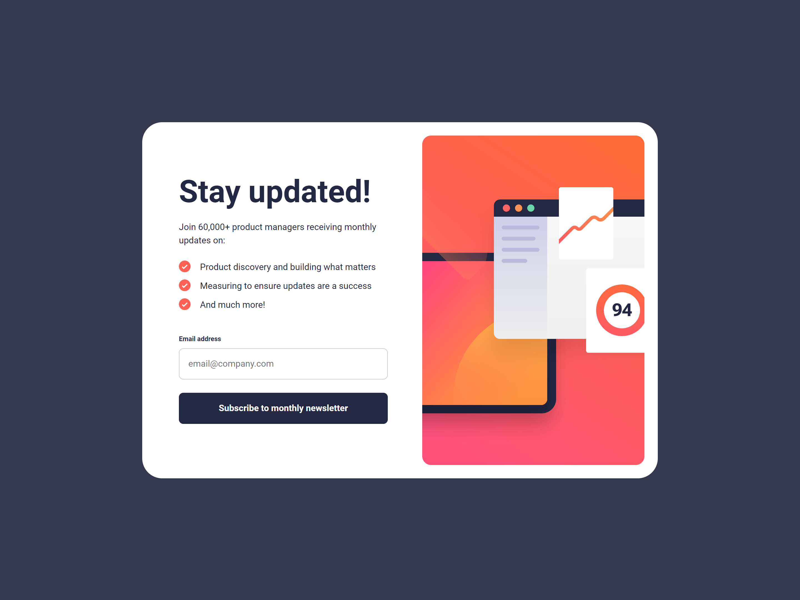
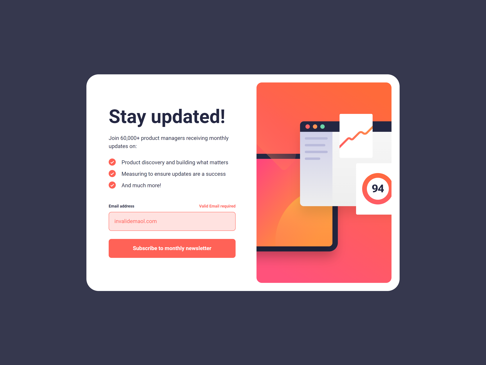
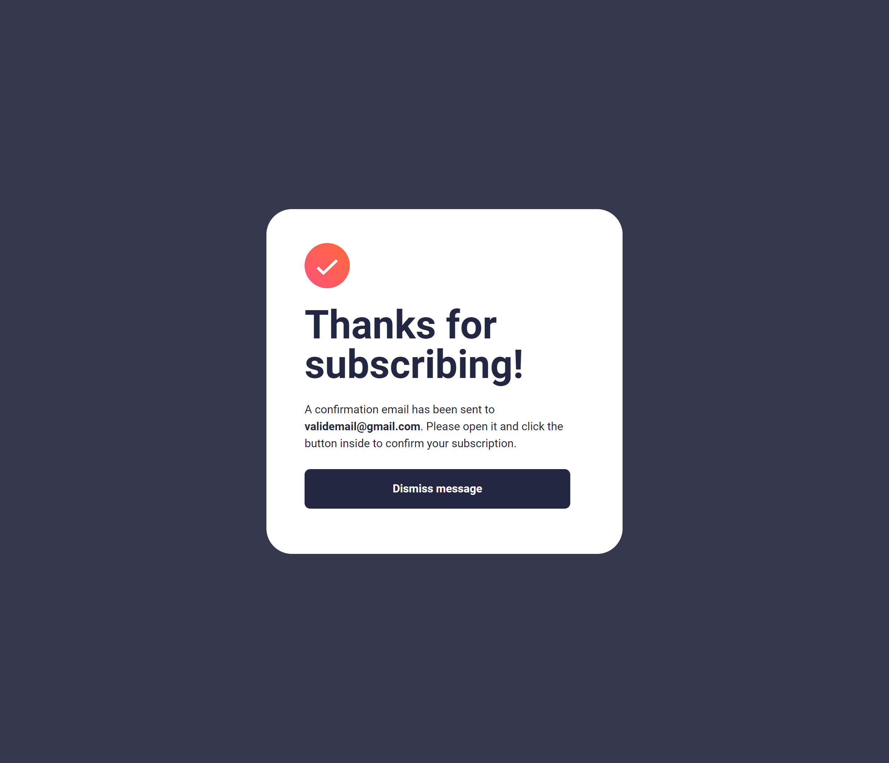
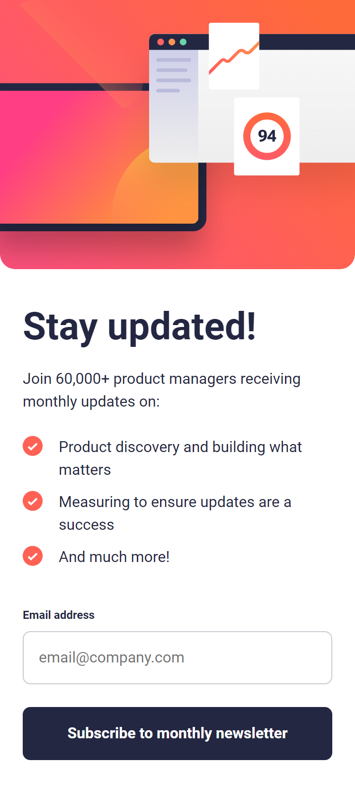

# Frontend Mentor - Newsletter Sign-Up Form with Success Message Solution

This is a solution to the [Newsletter Sign-Up Form with Success Message challenge on Frontend Mentor](https://www.frontendmentor.io/challenges/newsletter-signup-form-with-success-message-3FC1AZbNrv). This challenge helps improve your frontend coding skills by building realistic projects.

## Table of Contents

- [Overview](#overview)
  - [The Challenge](#the-challenge)
  - [Screenshot](#screenshot)
  - [Links](#links)
- [My Process](#my-process)
  - [Built With](#built-with)
  - [What I Learned](#what-i-learned)
  - [Continued Development](#continued-development)
  - [Useful Resources](#useful-resources)
- [Author](#author)
- [Acknowledgments](#acknowledgments)

## Overview

### The Challenge

Users should be able to:

- Add their email and submit the form.
- See a success message with their email after successfully submitting the form.
- See form validation messages if:
  - The field is left empty.
  - The email address is not formatted correctly.
- View the optimal layout for the interface depending on their device's screen size.
- See hover and focus states for all interactive elements on the page.

### Screenshot

  

    
    
<strong>Newsletter Sign-Up Form</strong>

  

  

    
    
<strong style="color: tomato">Invalid Email State</strong>

  

  

    
    
<strong style='color: green'>Successful Subscription</strong>

  

  

    
    
<strong>Mobile View</strong>

  

### Links

- [Visite the solution](https://your-solution-url.com)
- [Visit live Url](https://jomagene.github.io/newsletter-sign-up-with-success-message/)

## My Process

### Built With

- Semantic HTML5 markup
- Sass for styling
- Flexbox
- Mobile-first workflow
- JavaScript for form validation and local storage handling

### What I Learned

It was a pleasure working with the DOM and storing data in local storage. I learned how to retrieve data using the DOMContentLoaded event, which was new to me. This project deepened my understanding of handling user input dynamically.

### Continued Development

In the future, I plan to explore how to send emails to users who submit their information, adding more functionality to the form.

### Useful Resources

Here's the updated "Useful Resources" section with the FreeCodeCamp article included:

---

### Useful Resources

- [FreeCodeCamp - Build and Validate Beautiful Forms with Vanilla HTML, CSS, and JavaScript](https://www.freecodecamp.org/news/build-and-validate-beautiful-forms-with-vanilla-html-css-js/) - This article was instrumental in helping me understand form validation and building user-friendly forms with HTML, CSS, and JavaScript.
- [MDN Web Docs - Form Validation](https://developer.mozilla.org/en-US/docs/Learn/Forms/Form_validation) - Provided a solid foundation for understanding form validation.

## Author

- Frontend Mentor - [@Jomagene](https://www.frontendmentor.io/profile/Jomagene)
- Twitter - [@Jomanege](https://www.twitter.com/Jomagene)

## Acknowledgments

Thanks to the Frontend Mentor community for providing feedback and inspiration throughout the challenge.
